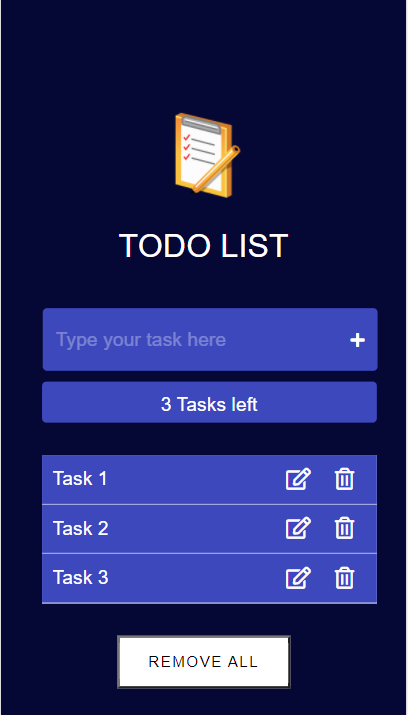

# To Do List

## Table of contents

- [Overview](#overview)
  - [The challenge](#the-challenge)
  - [Screenshot](#screenshot)
  - [Link](#Link)
- [My process](#my-process)
  - [Built with](#built-with)
  - [What I learned](#what-i-learned)
- [Author](#author)

## Overview

### The challenge

Using HTLM, CSS, Javascript and ReactJS (along with Local Storage React JS hooks feature) to create a TO DO List .

### Screenshot

### Link

- Solution URL : [https://github.com/Anish010/To-Do-List]
- Live Site URL : [https://anish-standard-calculator.netlify.app/]

## My process

### Built with

- Semantic HTML5 markup
- CSS custom properties
- Google Fonts
- Javascript
- React JS

### What I learned

With the help of this project i able to practice my CSS ,HTML skills and javascript DOM skills very well. It helped me to brush up my REACT JS skills useState , Hooks useEffect as well.

The Design and interface of this aplication is inspired from the public source.

## Author

- Linkedin - [Anish Kumar Mohanty](https://www.linkedin.com/in/anish-kumar-mohanty-68a019216/)
- Instagram - [@anish.mohanty\_](https://www.instagram.com/anish.mohanty_/)
